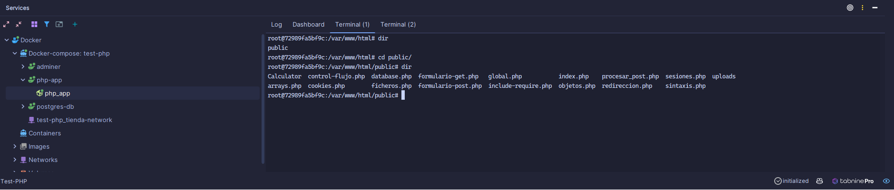
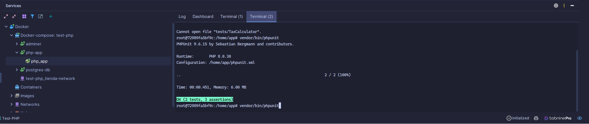

# Introducción a PHP

- [Introducción a PHP](#introducción-a-php)
  - [¿Qué es PHP?](#qué-es-php)
  - [Instalación de un entorno de desarrollo PHP](#instalación-de-un-entorno-de-desarrollo-php)
    - [Instalación y configuración de Apache en Linux](#instalación-y-configuración-de-apache-en-linux)
      - [Configuración básica de Apache](#configuración-básica-de-apache)
    - [Instalación y configuración de Apache en Windows](#instalación-y-configuración-de-apache-en-windows)
    - [En sistemas basados en Unix (Linux/macOS):](#en-sistemas-basados-en-unix-linuxmacos)
    - [En Windows:](#en-windows)
    - [XAMPP](#xampp)
  - [Composer](#composer)
    - [¿Cómo se usa Composer?](#cómo-se-usa-composer)
    - [Principales usos de Composer:](#principales-usos-de-composer)
    - [Manejo de Composer:](#manejo-de-composer)
    - [Packagist](#packagist)
    - [Cómo usar Packagist:](#cómo-usar-packagist)
  - [Docker de Desarrollo](#docker-de-desarrollo)
    - [Dockerfile](#dockerfile)
    - [Docker Compose](#docker-compose)
  - [Ejemplo de uso de consola de Docker directorio de web php](#ejemplo-de-uso-de-consola-de-docker-directorio-de-web-php)
  - [Ejemplo de uso de consola de Docker directorio de desarrollo: Composer, PHPUnit o Laravel](#ejemplo-de-uso-de-consola-de-docker-directorio-de-desarrollo-composer-phpunit-o-laravel)


## ¿Qué es PHP?
[PHP](https://www.php.net/manual/es/intro-whatis.php) es un lenguaje de programación de código abierto ampliamente utilizado para el desarrollo web. Sus siglas significan "PHP: Hypertext Preprocessor" (PHP: Preprocesador de Hipertexto). Fue creado originalmente por Rasmus Lerdorf en 1994 y desde entonces ha evolucionado y se ha convertido en uno de los lenguajes más populares para construir aplicaciones web dinámicas.

PHP se ejecuta en el lado del servidor, lo que significa que el código PHP se procesa en el servidor antes de que se envíe el resultado al navegador web del usuario. Esto permite que las páginas web generadas por PHP sean dinámicas, es decir, que puedan mostrar contenido diferente en función de variables, bases de datos, formularios, entre otros.


Una de las principales características de PHP es su integración con HTML, lo que facilita la creación de páginas web dinámicas. El código PHP se puede incrustar directamente en el código HTML, lo que permite mezclar la lógica de programación con la presentación visual.

PHP es compatible con una amplia gama de bases de datos, como MySQL, PostgreSQL, Oracle, entre otras. Esto permite a los desarrolladores almacenar y recuperar datos de manera eficiente para crear aplicaciones web interactivas y con capacidad de gestión.

Además de su compatibilidad con bases de datos, PHP cuenta con una gran cantidad de extensiones y librerías que facilitan el desarrollo de diferentes tipos de aplicaciones, como sistemas de gestión de contenido (CMS), foros, tiendas en línea y más. También es altamente personalizable y se puede integrar con otros lenguajes y tecnologías web, como HTML, CSS, JavaScript, XML, JSON, entre otros.

En resumen, PHP es un lenguaje de programación utilizado para desarrollar aplicaciones web dinámicas y altamente personalizables. Su integración con HTML, su compatibilidad con bases de datos y su amplia comunidad de desarrolladores lo convierten en una opción popular para la creación de sitios web interactivos y funcionales.

## Instalación de un entorno de desarrollo PHP

### Instalación y configuración de Apache en Linux

La mayoría de las distribuciones de Linux vienen con Apache disponible en sus repositorios oficiales. Aquí está cómo instalarlo en distribuciones basadas en Debian (como Ubuntu) y en distribuciones basadas en Red Hat (como CentOS).

**En distribuciones basadas en Debian (Ubuntu):**

1. Actualiza el listado de paquetes:
   ```bash
   sudo apt update
   ```

2. Instala Apache:
   ```bash
   sudo apt install apache2
   ```

3. Verifica que Apache se esté ejecutando:
   ```bash
   sudo systemctl status apache2
   ```

Una vez que Apache esté instalado, puedes acceder a él a través de tu navegador web ingresando `http://localhost` o `http://[tu-dirección-IP]`. Deberías ver la página predeterminada de Apache, que indica que el servidor está funcionando correctamente.

#### Configuración básica de Apache

Los archivos de configuración de Apache se encuentran generalmente en `/etc/apache2` en Debian/Ubuntu y en `/etc/httpd` en CentOS/Red Hat.

- **Configuración global**: El archivo principal de configuración para Apache es `apache2.conf` en Debian/Ubuntu (`httpd.conf` en CentOS/Red Hat). Aquí puedes configurar las opciones globales del servidor.

- **Sitios disponibles**: En Debian/Ubuntu, cada sitio web puede tener su propia configuración en un archivo separado dentro del directorio `/etc/apache2/sites-available`. Puedes habilitar y deshabilitar sitios con los comandos `a2ensite` y `a2dissite`.

- **Módulos**: Apache funciona con módulos que puedes habilitar o deshabilitar según tus necesidades. Los comandos `a2enmod` y `a2dismod` te permiten gestionar estos módulos en Debian/Ubuntu.

- **Archivos .htaccess**: Puedes usar archivos `.htaccess` para sobrescribir la configuración de Apache en directorios específicos. Sin embargo, por razones de rendimiento y seguridad, es mejor hacer la mayoría de las configuraciones a nivel de servidor o de sitio.

Después de hacer cambios en la configuración de Apache, siempre debes reiniciar el servicio para aplicarlos:
```bash
sudo systemctl restart apache2   # En Debian/Ubuntu
sudo systemctl restart httpd     # En CentOS/Red Hat
```

### Instalación y configuración de Apache en Windows

La instalación de Apache en Windows es menos común en entornos de producción, pero puede ser útil para desarrollo o pruebas locales.

1. **Descargar Apache**: Ve al sitio web oficial de Apache (httpd.apache.org) o a un sitio de terceros confiable que proporcione binarios para Windows, como Apache Lounge.

2. **Instalar Apache**: Extrae los archivos del binario descargado a una carpeta de tu elección, por ejemplo, `C:\Apache24`.

3. **Editar el archivo de configuración**: Abre el archivo `conf\httpd.conf` en un editor de texto y realiza los ajustes necesarios, como definir el `ServerRoot`, `DocumentRoot` y los permisos de directorio.

4. **Instalar el servicio de Apache**: Abre un símbolo del sistema con privilegios de administrador y navega hasta el directorio donde instalaste Apache. Ejecuta el siguiente comando para instalar Apache como un servicio de Windows:
   ```cmd
   httpd.exe -k install
   ```

5. **Iniciar el servicio Apache**: Puedes iniciar Apache a través del Administrador de servicios de Windows o utilizando el comando:
   ```cmd
   httpd.exe -k start
   ```

Una vez instalado y en ejecución, puedes acceder a Apache en tu navegador local ingresando `http://localhost`.


### En sistemas basados en Unix (Linux/macOS):

1. **Actualizar el gestor de paquetes:**
   - En Linux, esto podría ser `apt` para distribuciones basadas en Debian o `yum` para distribuciones basadas en RedHat.
     ```
     sudo apt update
     sudo apt upgrade
     ```
   - En macOS, si estás usando Homebrew, sería:
     ```
     brew update
     ```

2. **Instalar PHP:**
   - En Linux:
     ```
     sudo apt install php libapache2-mod-php
     ```
   - En macOS con Homebrew:
     ```
     brew install php
     ```

3. **Verificar la instalación:**
   - Puedes verificar que PHP esté instalado correctamente con:
     ```
     php -v
     ```

4. **Configurar PHP con Apache:**
   - Por lo general, al instalar el módulo `libapache2-mod-php`, Apache se configura automáticamente para trabajar con PHP.
   - Reinicia Apache para asegurarte de que los cambios surtan efecto:
     ```
     sudo systemctl restart apache2
     ```
   - En macOS, si estás usando el Apache incorporado, reinicia el servicio con:
     ```
     sudo apachectl restart
     ```

5. **Crear un archivo de prueba PHP:**
   - Crea un archivo llamado `info.php` en el directorio raíz de tu servidor web (por ejemplo, `/var/www/html` en muchas distribuciones Linux).
     ```
     echo "<?php phpinfo(); ?>" > /var/www/html/info.php
     ```

6. **Probar en el navegador:**
   - Abre tu navegador y ve a `http://localhost/info.php`. Deberías ver la página de información de PHP, indicando que PHP está funcionando correctamente.

### En Windows:

1. **Descargar PHP:**
   - Ve al sitio web oficial de PHP (php.net) y descarga la versión de PHP que desees instalar. Es recomendable descargar la versión de "Thread Safe".

2. **Extraer los archivos:**
   - Extrae los archivos en una carpeta de tu elección, por ejemplo, `C:\php`.

3. **Configurar el archivo `php.ini`:**
   - Copia `php.ini-development` o `php.ini-production` a `php.ini` y ábrelo con un editor de texto.
   - Configura las opciones según sea necesario, como `extension_dir` para especificar el directorio de extensiones.
   - Descomenta las extensiones que necesites habilitando la línea correspondiente (quitando el punto y coma al principio).

4. **Agregar PHP al PATH de Windows:**
   - Ve a "Sistema" en el Panel de Control, luego a "Configuración avanzada del sistema" y haz clic en "Variables de entorno".
   - Agrega la ruta del directorio de PHP (por ejemplo, `C:\php`) a la variable de entorno `PATH`.

5. **Configurar PHP con Apache en Windows:**
   - Si ya tienes Apache


Para instalar y configurar PHP con Apache de manera manual, debes seguir una serie de pasos que involucran la instalación de ambos componentes y su configuración para que trabajen juntos. Sin embargo, si prefieres una forma más sencilla y rápida de tener un entorno de desarrollo con PHP y Apache, puedes optar por usar XAMPP, que es un paquete que incluye Apache, MariaDB (una alternativa a MySQL), PHP y Perl.

Primero, te explicaré cómo instalar y configurar PHP con Apache manualmente y luego te hablaré sobre XAMPP.

### XAMPP

XAMPP es una distribución de Apache que incluye MariaDB, PHP y Perl, lo que hace que sea muy fácil de instalar y usar. Aquí hay una guía básica para instalar XAMPP:

**1. Descargar XAMPP:**

Ve al sitio web oficial de XAMPP (https://www.apachefriends.org/index.html) y descarga la versión para tu sistema operativo.

**2. Instalar XAMPP:**

- En Windows, ejecuta el instalador que descargaste y sigue las instrucciones.
- En sistemas Unix, es posible que debas dar permisos de ejecución al instalador y ejecutarlo desde la terminal.

**3. Iniciar los módulos Apache y MySQL:**

Después de la instalación, abre el Panel de Control de XAMPP y comienza los módulos Apache y MySQL.

**4. Probar la instalación:**

Abre tu navegador y ve a `http://localhost`. Deberías ver la página de bienvenida de XAMPP.

**5. Colocar tus archivos PHP:**

Para trabajar en tus proyectos PHP, coloca tus archivos en el subdirectorio `htdocs` dentro de la carpeta de instalación de XAMPP.

Con XAMPP, no necesitas configurar manualmente Apache o PHP, ya que el paquete incluye configuraciones predeterminadas que funcionan bien para la mayoría de los entornos de desarrollo. Esto hace que XAMPP sea una opción muy popular para los desarrolladores que desean configurar rápidamente un entorno de desarrollo local.


## Composer 

Composer es un sistema de gestión de dependencias para PHP. Permite a los desarrolladores declarar las bibliotecas de las que depende su proyecto y las gestiona (instala/actualiza) por ellos. Composer no es un gestor de paquetes en el mismo sentido que Yum o Apt son. Mientras que estos últimos gestionan paquetes en un ámbito global, Composer lo hace en un ámbito por proyecto.

### ¿Cómo se usa Composer?

**Instalación de Composer:**

Para instalar Composer, necesitas tener PHP instalado en tu sistema. La instalación de Composer puede hacerse de forma global (disponible en todo el sistema) o localmente (dentro de un directorio específico, por proyecto).

1. **Instalación Global en Unix/Linux/macOS:**
   ```sh
   curl -sS https://getcomposer.org/installer | php
   mv composer.phar /usr/local/bin/composer
   ```

2. **Instalación Global en Windows:**
   Descarga y ejecuta el instalador de Windows desde [getcomposer.org](https://getcomposer.org/download/), que configurará todo automáticamente.

**Uso básico de Composer:**

1. **Inicializar un nuevo proyecto de PHP con Composer:**
   ```sh
   composer init
   ```
   Este comando te guiará a través de la creación de un archivo `composer.json` para tu proyecto.

2. **Añadir dependencias:**
   Para añadir una nueva dependencia a tu proyecto, usa el comando `require`:
   ```sh
   composer require <vendor/package>
   ```
   Esto actualizará el archivo `composer.json` y también instalará el paquete y sus dependencias en el directorio `vendor`.

3. **Instalar dependencias:**
   Si ya tienes un archivo `composer.json` con dependencias definidas, ejecutar el siguiente comando instalará todas esas dependencias:
   ```sh
   composer install
   ```
   Esto es común cuando clonas un proyecto existente que usa Composer.

4. **Actualizar dependencias:**
   Para actualizar todas tus dependencias a sus últimas versiones (según las restricciones definidas en `composer.json`), puedes usar:
   ```sh
   composer update
   ```

5. **Autoload:**
   Composer genera automáticamente un archivo de autoload que puedes incluir en tu proyecto para obtener carga automática de clases:
   ```php
   require 'vendor/autoload.php';
   ```

### Principales usos de Composer:

- **Gestión de dependencias:** Composer te permite especificar versiones de paquetes para evitar problemas de incompatibilidad.
- **Autoloading:** Composer proporciona un autoloader que es compatible con el estándar PSR-4.
- **Versionado semántico:** Composer sigue el versionado semántico, lo que facilita la comprensión de las actualizaciones de las dependencias.
- **Entornos coherentes:** Al usar `composer.lock`, los equipos pueden sincronizar las versiones exactas de las dependencias, asegurando que todos trabajen en un entorno coherente.
- **Repositorios de paquetes:** Composer se integra con Packagist, el repositorio principal de paquetes PHP, pero también puede trabajar con repositorios privados o VCS (sistemas de control de versiones).

### Manejo de Composer:

- **composer.json:** Es el archivo de definición de tu proyecto, donde especificas las dependencias y metadatos del proyecto.
- **composer.lock:** Es un archivo de bloqueo que se genera después de instalar o actualizar las dependencias, asegurando que todos los miembros del equipo instalen exactamente las mismas versiones.
- **vendor/:** Es el directorio donde Composer instala las dependencias del proyecto.

Es importante entender que Composer se ha convertido en una herramienta esencial para la moderna programación PHP, ya que facilita la gestión de dependencias y el mantenimiento de proyectos grandes y complejos.

### Packagist
Para buscar librerías que puedes gestionar con Composer, el principal repositorio es Packagist. Packagist es el repositorio oficial de paquetes PHP que son utilizables con Composer. Aquí es donde los desarrolladores publican sus paquetes PHP y donde puedes buscar y explorar paquetes disponibles para usar en tus proyectos.

### Cómo usar Packagist:

**1. Visita el sitio web:**
   - Ve a [packagist.org](https://packagist.org/).

**2. Busca paquetes:**
   - Puedes buscar paquetes utilizando el cuadro de búsqueda proporcionando el nombre del paquete, el nombre del vendedor o alguna funcionalidad que estés buscando.
   - También puedes explorar paquetes por etiquetas, popularidad, tendencias, etc.

**3. Examinar un paquete:**
   - Una vez encuentres un paquete que te interese, haz clic en él para ver detalles como la descripción, versiones disponibles, dependencias, información de licencia, autores, y más.
   - En la página del paquete, encontrarás el comando `composer require` que necesitas para incluir ese paquete en tu proyecto.

**4. Revisar la documentación del paquete:**
   - Es importante leer la documentación del paquete para entender cómo usarlo correctamente en tu proyecto. La documentación suele incluir ejemplos de uso, opciones de configuración y otros detalles importantes.

**5. Instalar el paquete:**
   - Para instalar el paquete, puedes utilizar el comando que proporciona Packagist en tu terminal o consola:
     ```bash
     composer require vendor/package
     ```
   - Esto actualizará tu archivo `composer.json` y descargará el paquete junto con sus dependencias en el directorio `vendor` de tu proyecto.


## Docker de Desarrollo
Puedes usar un docker de sarllo usando` docker compose` y `Dockerfile` con PHP, Composer y Apache listo y montando los directorios, bases de datos y todo lo necesario para empezar a desarrollar.

### Dockerfile
```dockerfile	
# Dockerfile
FROM php:8.0-apache

# Instala las extensiones pdo_pgsql para PHP y otras extensiones comunes
RUN apt-get update && apt-get install -y --fix-missing \
        libpq-dev \
        libpng-dev \
        libonig-dev \
        libxml2-dev \
        zip \
        unzip \
        git \
    && apt-get clean \
    && docker-php-ext-install pdo_pgsql mbstring exif pcntl bcmath gd

# Instala Composer
COPY --from=composer:latest /usr/bin/composer /usr/bin/composer

# Configura el document root
ENV APACHE_DOCUMENT_ROOT /var/www/html/public

# Cambia el document root del servidor Apache
RUN sed -ri -e 's!/var/www/html!${APACHE_DOCUMENT_ROOT}!g' /etc/apache2/sites-available/*.conf
RUN sed -ri -e 's!/var/www/!${APACHE_DOCUMENT_ROOT}!g' /etc/apache2/apache2.conf /etc/apache2/conf-available/*.conf

# Habilita el mod_rewrite para Apache
RUN a2enmod rewrite
```

### Docker Compose
```yaml
version: '3.8'

services:
  # PHP with Apache service
  php-app:
    build: .
    container_name: php_app
    ports:
      - "${APP_PORT}:80"
    env_file: .env
    volumes:
      - ./src:/var/www/html/public # Usar el directorio ficheros de la aplicación web
      - uploads:/var/www/html/public/uploads  # Usar el volumen nombrado o usar el directorio local para subir ficheros ./uploads
      - ./:/home/app # Usar el directorio local para el código fuente de la aplicación y proyecto
    depends_on:
      - postgres-db
    # restart: always
    environment:
      DATABASE_HOST: postgres-db
      DATABASE_USER: ${POSTGRES_USER}
      DATABASE_PASSWORD: ${POSTGRES_PASSWORD}
      DATABASE_NAME: ${POSTGRES_DB}
      APACHE_DOCUMENT_ROOT: /var/www/html/public
    networks:
      - tienda-network

  # PostgreSQL service
  postgres-db:
    image: postgres:12-alpine
    container_name: postgres_db
    env_file: .env
    # restart: always
    ports:
      - "${POSTGRES_PORT}:5432"
    volumes:
      - ./database/init.sql:/docker-entrypoint-initdb.d/init.sql # script de inicio sql por si queremos crear tablas o meter datos
      - db_data:/var/lib/postgresql/data # Usar el volumen nombrado para persistencia de datos de BD
    environment:
      POSTGRES_DB: ${POSTGRES_DB}
      POSTGRES_USER: ${POSTGRES_USER}
      POSTGRES_PASSWORD: ${POSTGRES_PASSWORD}
    networks:
      - tienda-network

  # Adminer service
  adminer:
    image: adminer
    container_name: adminer
    # restart: always
    env_file: .env
    ports:
      - "8081:8080"
    depends_on:
      - postgres-db
    networks:
      - tienda-network

volumes:
  db_data:
  uploads:

networks:
  tienda-network:
    driver: bridge
```

## Ejemplo de uso de consola de Docker directorio de web php


## Ejemplo de uso de consola de Docker directorio de desarrollo: Composer, PHPUnit o Laravel


