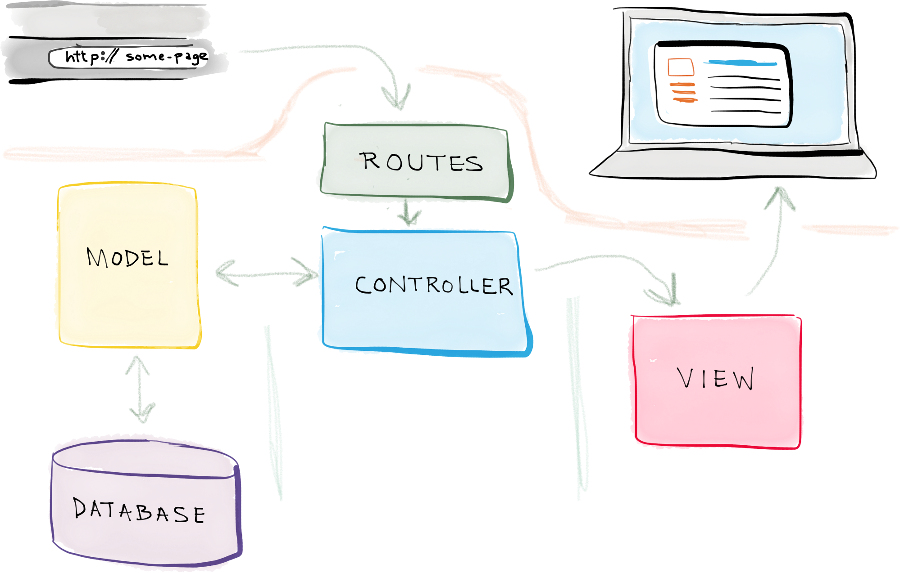

# Introducción a Laravel

- [Introducción a Laravel](#introducción-a-laravel)
  - [Laravel](#laravel)
    - [Estructura de un proyecto Laravel](#estructura-de-un-proyecto-laravel)

## Laravel
Laravel es un framework de desarrollo de aplicaciones web de código abierto y de alto nivel, escrito en PHP. Fue creado por Taylor Otwell en 2011 y se ha convertido en uno de los frameworks más populares y ampliamente utilizados en la comunidad de desarrollo web.

Laravel sigue el patrón de diseño MVC (Modelo-Vista-Controlador), lo que proporciona una estructura organizada y modular para construir aplicaciones web. Proporciona una amplia gama de características y herramientas que facilitan el desarrollo rápido y eficiente de aplicaciones web robustas y escalables.

Algunas de las características destacadas de Laravel incluyen:

1. Enrutamiento: Laravel proporciona un sistema de enrutamiento fácil de usar que permite definir rutas para diferentes URI y métodos HTTP.

2. ORM (Object-Relational Mapping): Laravel incluye un ORM llamado Eloquent, que simplifica la interacción con la base de datos al proporcionar una forma intuitiva de trabajar con modelos y consultas.

3. Migraciones de base de datos: Laravel ofrece migraciones de base de datos, que permiten mantener el control de los cambios en la estructura de la base de datos a través de archivos de migración.

4. Plantillas Blade: Laravel utiliza el motor de plantillas Blade, que proporciona una sintaxis sencilla y expresiva para trabajar con vistas y facilita la reutilización de código.

5. Autenticación y autorización: Laravel proporciona un sistema de autenticación y autorización completo y fácil de usar, que incluye características como el registro de usuarios, inicio de sesión, restablecimiento de contraseñas y control de acceso basado en roles.

6. Pruebas automatizadas: Laravel tiene soporte integrado para pruebas automatizadas, lo que facilita la escritura y ejecución de pruebas unitarias y de integración para garantizar la calidad del código.

El modelo de funcionamiento es el siguiente:

### Estructura de un proyecto Laravel
La estructura de un proyecto de Laravel sigue una convención bien definida que organiza los archivos y directorios de manera lógica y coherente. Aquí tienes una descripción de los principales directorios y archivos en un proyecto de Laravel:

1. `app`: Este directorio es el corazón de la aplicación y contiene la lógica de negocio de tu proyecto. Aquí encontrarás los modelos (archivos que representan las tablas de la base de datos), controladores (archivos que manejan las solicitudes HTTP y orquestan la lógica de la aplicación) y otros archivos relacionados con la lógica de la aplicación.

2. `bootstrap`: Este directorio contiene archivos relacionados con el inicio de la aplicación, como la carga de la configuración y la configuración del autoloading de clases.

3. `config`: Aquí se encuentran los archivos de configuración de la aplicación. Puedes definir la configuración de la base de datos, el correo electrónico, el almacenamiento en caché y otros aspectos de la aplicación en estos archivos.

4. `database`: En este directorio se encuentran los archivos relacionados con la base de datos. Aquí puedes definir las migraciones (archivos que representan cambios en la estructura de la base de datos), los seeders (archivos que se utilizan para poblar la base de datos con datos de prueba) y otros archivos relacionados con la base de datos.

5. `public`: Este directorio es el punto de entrada de tu aplicación y contiene el archivo `index.php`, que es el archivo que se ejecuta cuando se realiza una solicitud HTTP a tu aplicación. También encontrarás archivos estáticos como imágenes, hojas de estilo CSS y archivos JavaScript en este directorio.

6. `resources`: Aquí se almacenan los recursos de la aplicación, como las vistas (archivos de plantillas que definen la interfaz de usuario), los archivos de lenguaje y los archivos de assets (como hojas de estilo y scripts JavaScript) sin compilar.

7. `routes`: En este directorio encontrarás los archivos de definición de rutas de tu aplicación. Las rutas determinan cómo se manejan las solicitudes HTTP y qué controlador y método se ejecutan para cada ruta.

8. `storage`: Este directorio almacena archivos generados por la aplicación, como archivos de registro, archivos de sesión y archivos cargados por los usuarios. También contiene subdirectorios para almacenar archivos en caché, vistas compiladas y otros archivos generados.

9. `tests`: Aquí se encuentran los archivos de pruebas de tu aplicación. Laravel incluye un sistema de pruebas integrado que te permite escribir y ejecutar pruebas unitarias y de integración para asegurarte de que tu código funcione correctamente.

10. `vendor`: Este directorio contiene las dependencias de tu proyecto, que son administradas por Composer, el administrador de paquetes de PHP. Aquí se almacenan los paquetes y bibliotecas de terceros utilizados en tu proyecto.

Además de estos directorios principales, también encontrarás archivos como `.env` (archivo de configuración de variables de entorno), `composer.json` (archivo de configuración de Composer) y otros archivos de configuración y utilidad.

Esta es una descripción general de la estructura de un proyecto de Laravel. Cabe destacar que Laravel es altamente personalizable y puedes ajustar la estructura y los nombres de los directorios según tus necesidades, utilizando las configuraciones y convenciones proporcionadas por el framework.